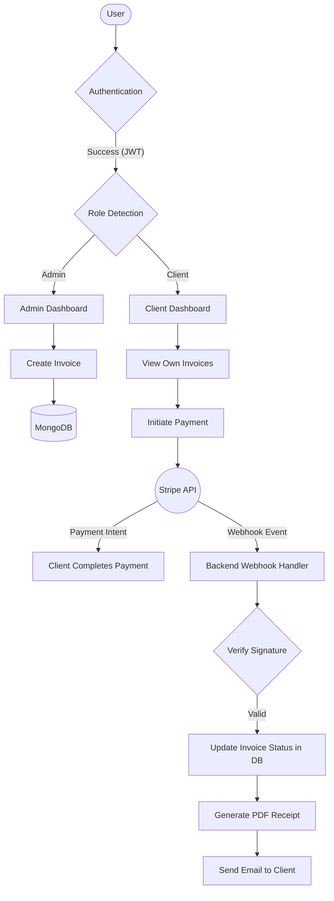
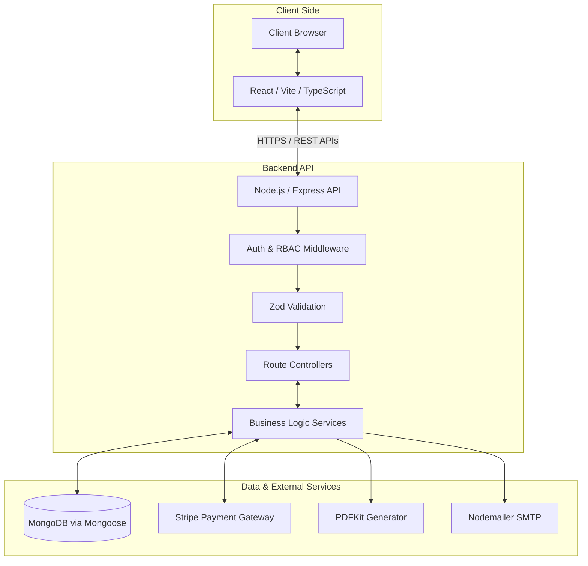

# 💳 VaultPay Financial Core

A secure B2B invoice management and payment platform designed to streamline invoice creation, client billing, online payments, PDF receipts, and role-based financial workflows.


---

## 1. 📋 Table of Contents
- [2. 🎯 Project Overview](#2--project-overview)
- [3. ❗ Problem Statement](#3--problem-statement)
- [4. 💡 Solution](#4--solution)
- [5. ✨ Key Features](#5--key-features)
- [6. 👥 User Roles](#6--user-roles)
- [7. 🔄 Application Flow](#7--application-flow)
- [8. 🏗️ High-Level Architecture](#8--high-level-architecture)
- [9. 🚀 Tech Stack](#9--tech-stack)
- [10. 🛠️ Local Development Setup](#10--local-development-setup)
- [11. 🔒 Security Posture](#11--security-posture)

---

## 2. 🎯 Project Overview

VaultPay is a modern, enterprise-grade financial portal designed specifically for secure B2B invoice management and payment processing. 

It serves two primary users: **Administrators** (the business owners/finance teams generating invoices) and **Clients** (the customers paying the invoices). By centralizing billing, VaultPay eliminates the friction of email-based invoicing, provides real-time payment status tracking, and offers a secure, self-serve client portal where businesses can safely view and pay their outstanding balances via Stripe.

---

## 3. ❗ Problem Statement

Traditionally, B2B billing workflows suffer from several critical inefficiencies:
- **Manual Overhead:** Invoices are manually created, exported as PDFs, and emailed to clients.
- **Fragmented Visibility:** Clients lack a centralized dashboard to view their payment history and outstanding balances.
- **Delayed Payments:** Collecting payments requires slow ACH transfers, manual wire verifications, or disjointed third-party payment links.
- **Security Risks:** Exchanging financial data and payment statuses over unencrypted email channels poses security and compliance risks.

**Business Impact:** These inefficiencies lead to delayed cash flow, administrative bloat, frustrated clients, and increased risk of human error or financial data exposure.

---

## 4. 💡 Solution

VaultPay solves these problems by providing an end-to-end, role-based billing ecosystem:

1. **Invoice Management:** Admins can quickly generate and manage invoices within a secure dashboard.
2. **Client Portal:** Clients log into a secure, isolated environment where they can only view their specific invoices (enforced via server-side authorization).
3. **Integrated Payments:** Clients can securely pay invoices directly on the platform using an integrated Stripe Elements checkout flow.
4. **Automated Reconciliation:** Stripe Webhooks serve as the source of truth, automatically updating invoice statuses in the database upon successful payment.
5. **Automated Documentation:** Upon payment, the system automatically generates a PDF receipt via PDFKit and optionally triggers email notifications via Nodemailer.

---

## 5. ✨ Key Features

### 🔐 Authentication & Authorization
- **JWT Authentication:** Stateless, secure token-based authentication (HttpOnly cookies).
- **Role-Based Access Control (RBAC):** Strict separation between `admin` and `client` routes.
- **IDOR Prevention:** Server-side validation ensures clients can only query and view their own data.

### 🧾 Invoice Management
- **Admin Dashboard:** Full CRUD capabilities for managing clients and issuing invoices.
- **Client Dashboard:** Read-only access to personal invoice history and outstanding balances.
- **Real-time Statuses:** Track invoices through `Draft`, `Pending`, `Paid`, and `Overdue` states.

### 💳 Secure Payments
- **Stripe Integration:** Processing payments via secure Stripe Payment Intents and Elements.
- **Idempotency & State Handling:** Robust loading states, double-click prevention, and error handling during checkout.
- **Webhook-Based Confirmation:** Payment success is verified cryptographically via Stripe Webhooks, preventing client-side spoofing.

### 📄 Document Management
- **Dynamic PDF Generation:** Automated on-the-fly generation of invoice documents and payment receipts using PDFKit.
- **Browser Download:** Secure streaming of PDFs directly to the client browser.

### 📧 Automated Communication
- **Email Notifications:** Transactional emails powered by Nodemailer for payment confirmations and receipt delivery.

---

## 6. 👥 User Roles

| Role | Capabilities | Authorization Boundary |
|------|--------------|------------------------|
| **Admin** | Create/Manage clients, Create/Update/Delete invoices, View system-wide financial data. | Protected by Admin-only JWT middleware. Cannot execute client payment flows. |
| **Client** | View personal invoices, Pay outstanding invoices, Download PDF receipts. | Protected by Client JWT middleware. Strict ownership validation on all database queries (IDOR protection). Cannot access Admin APIs. |

---

## 7. 🔄 Application Flow



---

## 8. 🏗️ High-Level Architecture



---

## 9. 🚀 Tech Stack

**Frontend:**
- React 19
- TypeScript
- Vite
- React Router DOM
- Axios & TanStack React Query
- Lucide React (Icons)
- Stripe React Elements

**Backend:**
- Node.js
- Express.js
- TypeScript (tsx)
- MongoDB (Mongoose)
- JWT (jsonwebtoken) & bcrypt
- Zod (Input Validation)
- Stripe Node SDK
- PDFKit (Document Generation)
- Nodemailer (Email Delivery)

---

## 10. 🛠️ Local Development Setup

### Prerequisites
- Node.js (v18+)
- MongoDB instance (local or Atlas)
- Stripe Account (for API keys)

### Environment Variables
You must create a `.env` file in the `backend` directory. **Never commit this file.**

```env
# Backend .env
PORT=5000
MONGODB_URI=mongodb://localhost:27017/vaultpay
JWT_SECRET=your_super_secret_jwt_key
STRIPE_SECRET_KEY=sk_test_...
STRIPE_WEBHOOK_SECRET=whsec_...
SMTP_HOST=smtp.example.com
SMTP_PORT=587
SMTP_USER=user@example.com
SMTP_PASS=your_smtp_password
FRONTEND_URL=http://localhost:5173
```

You must also create a `.env` file in the `frontend` directory:

```env
# Frontend .env
VITE_API_URL=http://localhost:5000/api
VITE_STRIPE_PUBLISHABLE_KEY=pk_test_...
```

### Running the Project

1. **Install Dependencies**
   ```bash
   cd backend && npm install
   cd ../frontend && npm install
   ```

2. **Start Backend Server**
   ```bash
   cd backend
   npm run dev
   ```

3. **Start Frontend Dev Server**
   ```bash
   cd frontend
   npm run dev
   ```

4. **Stripe Webhook Forwarding (Local Testing)**
   ```bash
   stripe listen --forward-to localhost:5000/api/payments/webhook
   ```

---

## 11. 🔒 Security Posture

VaultPay is built with security as a first-class citizen:

- **No Secrets in Source Control:** `.env` files are strictly excluded via `.gitignore`.
- **Stateless Authorization:** JWTs are used for secure session management.
- **Server-Side Validation:** Never trust the client. All inputs are validated via `zod`.
- **IDOR Prevention:** Client API endpoints implicitly inject the authenticated user's ID into database queries to ensure a client can never access another client's invoice.
- **Secure Webhooks:** Payment confirmations are strictly handled via Stripe Webhooks, utilizing cryptographic signature verification (`stripe.webhooks.constructEvent`) to prevent spoofed payment success payloads.
- **CORS & Helmet:** Protected by configured Cross-Origin Resource Sharing and HTTP security headers.
- **Safe Database Queries:** Utilizing Mongoose ODMs to prevent NoSQL injection attacks.
